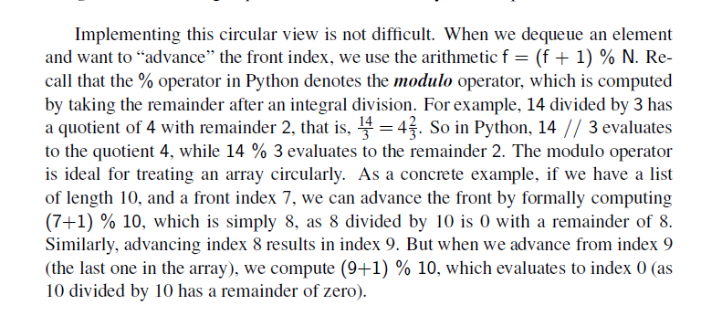
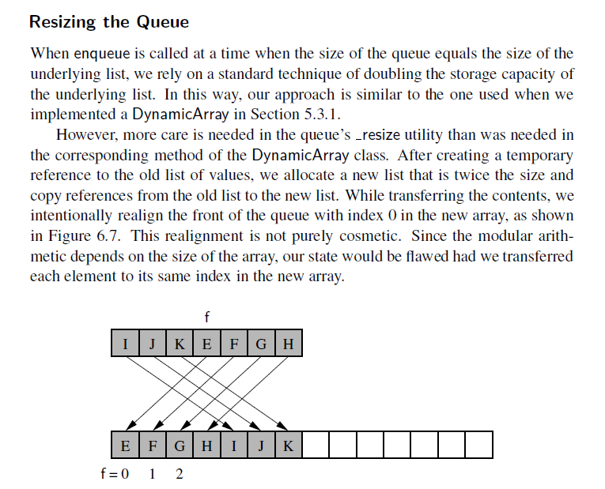

# Implementation 

```python

class Queue:

    DEFAULT_CAPACITY = 10
    def __init__(self):
        self._data = [None] * self.DEFAULT_CAPACITY
        self._front = 0
        self._size = 0

    def __len__(self):
        return self._size
    
    def is_empty(self):
        return self._size == 0
    
    def first(self):
        
        if self.is_empty():
            return "queue is empty"
        return self._data[self._first]

        
    def dequeue(self):

        if self.is_empty():
            return "queue is empty"
        
        res = self._data[self._front]
        self._data[self._front] = None
        self._front = (self._front + 1) % len(self._data)
        self._size -= 1
        return res

    def enqueue(self, e):

        if self._size == len(self._data):
            self._resize(2 * len(self._data))

        index = (self._front + self._size) % len(self._data)
        self._data[index] = e
        self._size += 1

    def resize(self, amount):

        old = self._data
        self._data = [None] * amount
        walk = self._front

        for i in range(len(old)):
            self._data[i] = old[walk]
            walk = (walk + 1) % len(old)
        self._front = 0

```


# Queue

```
Queues

Another fundamental data structure is the queue. It is a close “cousin” of the stack,
as a queue is a collection of objects that are inserted and removed according to the
first-in, first-out (FIFO) principle. That is, elements can be inserted at any time,
but only the element that has been in the queue the longest can be next removed.

Use-Cases 
- Printers
- Web server responding requests 

In the implementation, the queue is a circular queue. This is to make the dequeue operation efficient 

queue.remove(first) is a O(n) operation 





```
