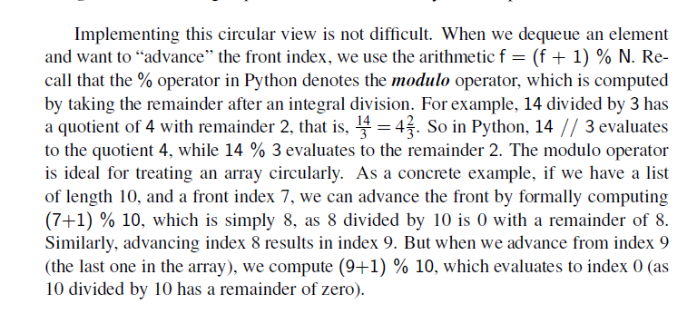
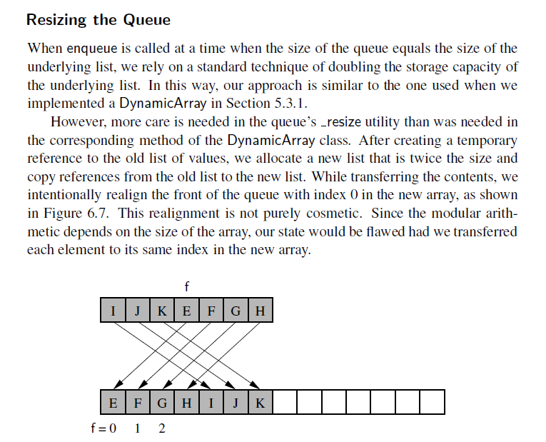

Queues

Another fundamental data structure is the queue. It is a close “cousin” of the stack,
as a queue is a collection of objects that are inserted and removed according to the
first-in, first-out (FIFO) principle. That is, elements can be inserted at any time,
but only the element that has been in the queue the longest can be next removed.

Use-Cases 
- Printers
- Web server responding requests 

In the implementation, the queue is a circular queue. This is to make the dequeue operation efficient 

queue.remove(first) is a O(n) operation 

