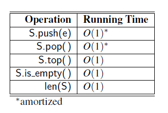

LIFO(last in first out)
S.push(e): Add element e to the top of stack S.
S.pop(): Remove and return the top element from the stack S; an error occurs if the stack is empty. Additionally, let us define the following accessor methods for convenience:
S.top(): Return a reference to the top element of stack S, without removing it; an error occurs if the stack is empty.
S.is empty(): Return True if stack S does not contain any elements.
len(S): Return the number of elements in stack S; in Python, we implement this with the special method len

